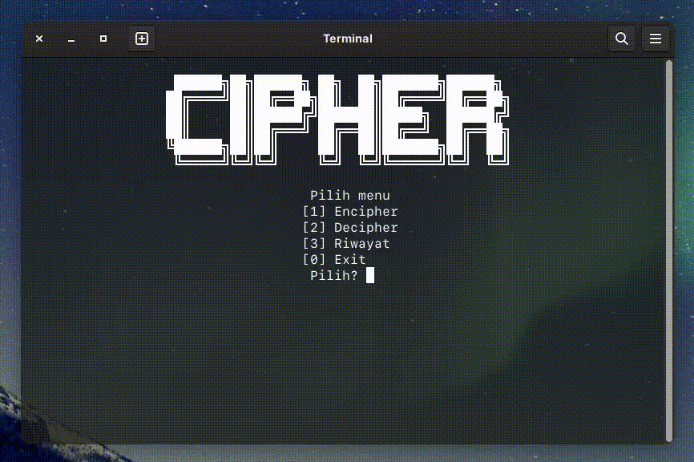

# ˈsīfər

Encipher (~Mengubah sebuah pesan menjadi sebuah kode)<br>
Decipher (~Mengubah kode menjadi sebuah pesan)

---

### Screenshot

---

- Awal program


- Menu Cipher


- Menu Decipher


- Menu Encipher


- Menu Riwayat (READ, UPDATE, DELETE)


---

## Fitur Baru

---

- Auto Enter



Fitur ini membutuhkan library tambahan!

### Windows

Untuk Windows dibutuhkan library conio.h<br>
Karena di beberapa compiler #include <conio.h> sudah tidak dapat digunakan<br>
Maka disarankan menggunakan Embarcadero Dev-C++ (Dev-C++ dengan compiler \*terbaru)<br>
Download disini <https://github.com/Embarcadero/Dev-Cpp><br>
Atau dapat menambahkan secara manual Compiler TDM-GCC kedalam path environment

### Linux & macOS

Untuk Linux & macOS dibutuhkan library curses.h atau ncurses.h<br>
Sebelum dapat menggunakan #include <ncurses.h> atau #include <curses.h> ke dalam source code<br>
Pastikan ncurses telah terinstall<br>
<br>
<b>Berikut cara memastikan apakah ncurses terinstall:</b>

#### Ubuntu (Atau Linux berbasis Debian lainnya)

```sh
dpkg -s libncurses5-dev
```

#### Fedora (Atau Linux berbasis Red Hat lainnya)

```sh
rpm -qa | grep ncurses
```

#### macOS

```sh
ncurses --version
```

Jika ncurses tidak ditemukan, maka install terlebih dahulu<br>
<br>
<b>Cara install:</b>

#### Ubuntu (Atau Linux berbasis Debian lainnya)

```sh
sudo apt install libncurses5-dev libncursesw5-dev
```

#### Fedora (Atau Linux berbasis Red Hat lainnya)

```sh

sudo dnf install ncurses-devel

```

#### macOS

```sh

brew install ncurses

```

<br>

<b>Selanjutnya:</b><br>
Pasang linker -lncurses pada IDE<br>
Atau bisa menambahkannya saat akan melakukan proses compile secara manual<br>
Misal CMD atau Terminal sudah ada di folder yang sama dengan source code (bernama cipher.cpp), maka

```sh

g++ -lncurses cipher.cpp -o cipher

```

Atau

```sh

clang++ -lncurses cipher.cpp -o cipher

```

---

### List Fitur

---

| Fitur           | TERSEDIA | BELUM | BUG         |
| --------------- | :------: | :---: | ----------- |
| TEKS ke Biner   |    ✅    |       | None so far |
| Biner ke Teks   |    ✅    |       | None so far |
| Teks ke Desimal |    ✅    |       | None so far |
| Desimal ke Teks |    ✅    |       | None so far |
| Teks ke Heksa   |    ✅    |       | None so far |
| Heksa ke Teks   |    ✅    |       | None so far |
| Teks ke Oktal   |    ✅    |       | None so far |
| Oktal ke Teks   |    ✅    |       | None so far |
| CREATE          |    ✅    |       | None so far |
| READ            |    ✅    |       | None so far |
| UPDATE          |    ✅    |       | None so far |
| DELETE          |    ✅    |       | None so far |
| Data Base       |    ✅    |       | None so far |

---

#### Kendala

---

Baris kode yang masih terlalu panjang <br>
Penulisan kode masih belum efektif dan efisien
