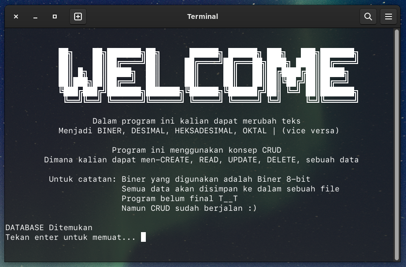
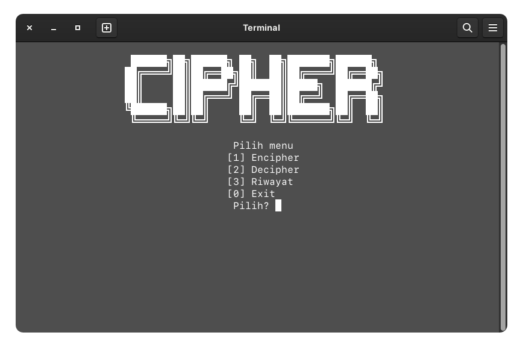
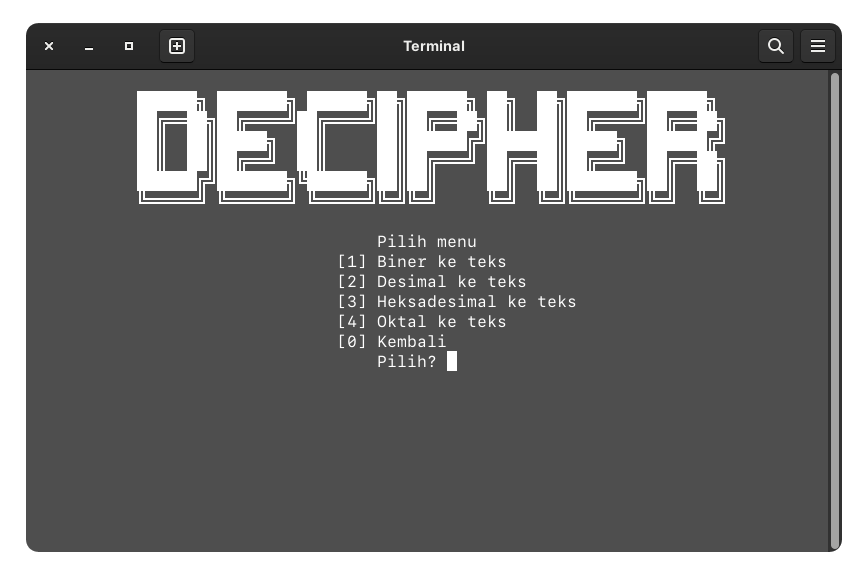
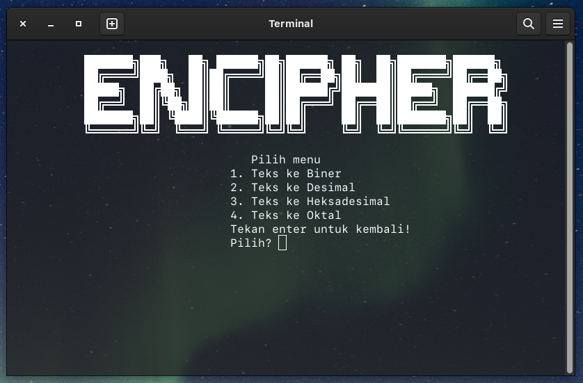
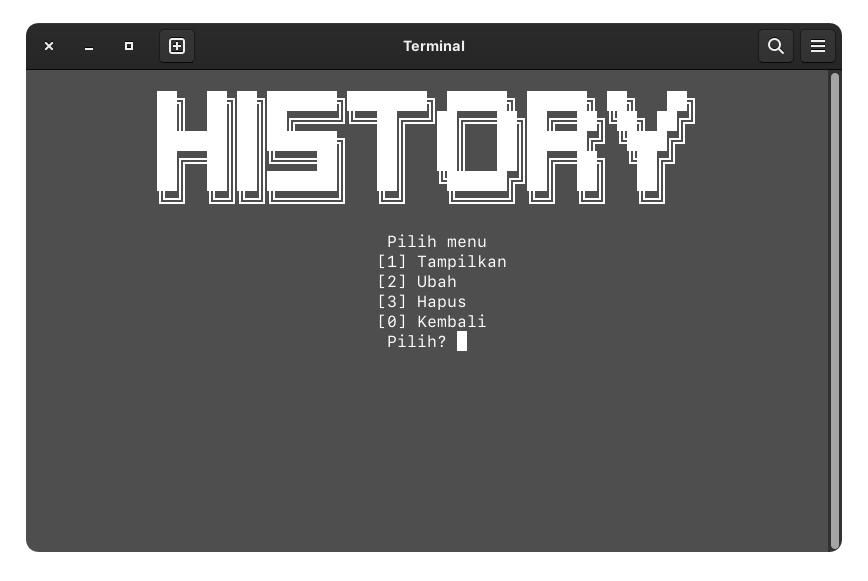
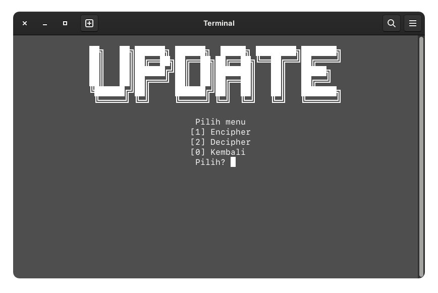
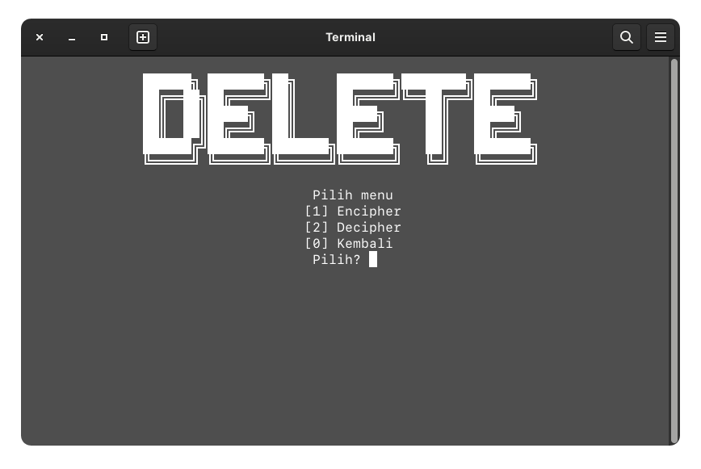

# ˈsīfər

Encipher (~Mengubah sebuah pesan menjadi sebuah kode)<br>
Decipher (~Mengubah kode menjadi sebuah pesan)

---

### Screenshot

---

- Awal program



- Menu Cipher



- Menu Decipher



- Menu Encipher



- Menu Riwayat (READ, UPDATE, DELETE)







---

## Fitur Baru

---

- Auto Enter


Fitur ini membutuhkan library tambahan!

### Windows

Untuk Windows dibutuhkan library conio.h<br>
Karena di beberapa compiler #include <conio.h> sudah tidak dapat digunakan<br>
Maka disarankan menggunakan Embarcadero Dev-C++ (Dev-C++ dengan compiler \*terbaru)<br>
Download disini <https://github.com/Embarcadero/Dev-Cpp><br>
Atau dapat menambahkan secara manual Compiler TDM-GCC kedalam path environment

### Linux

Untuk Linux dibutuhkan library curses.h atau ncurses.h<br>
Sebelum dapat menggunakan #include <ncurses.h> atau #include <curses.h> ke dalam source code<br>
Pastikan ncurses telah terinstall<br>
<br>
Berikut cara memastikan apakah ncurses terinstall:

#### Ubuntu

```sh
dpkg -s libncurses5-dev
```

#### Fedora

```sh
rpm -qa | grep ncurses
```

Jika ncurses tidak ditemukan, maka install terlebih dahulu<br>
<br>
Cara install:

#### Ubuntu

```sh
sudo apt install libncurses5-dev libncursesw5-dev
```

---

### List Fitur

---

| Fitur           | TERSEDIA | BELUM | BUG         |
| --------------- | :------: | :---: | ----------- |
| TEKS ke Biner   |    ✅    |       | None so far |
| Biner ke Teks   |    ✅    |       | None so far |
| Teks ke Desimal |    ✅    |       | None so far |
| Desimal ke Teks |    ✅    |       | None so far |
| Teks ke Heksa   |          |  ⭕️  |             |
| Heksa ke Teks   |          |  ⭕️  |             |
| Teks ke Oktal   |          |  ⭕️  |             |
| Oktal ke Teks   |          |  ⭕️  |             |
| CREATE          |    ✅    |       | None so far |
| READ            |    ✅    |       | None so far |
| UPDATE          |    ✅    |       | None so far |
| DELETE          |    ✅    |       | None so far |
| Data Base       |    ✅    |       | None so far |

---

#### Kendala

---

Baris kode yang masih terlalu panjang <br>
Penulisan kode masih belum efisien
