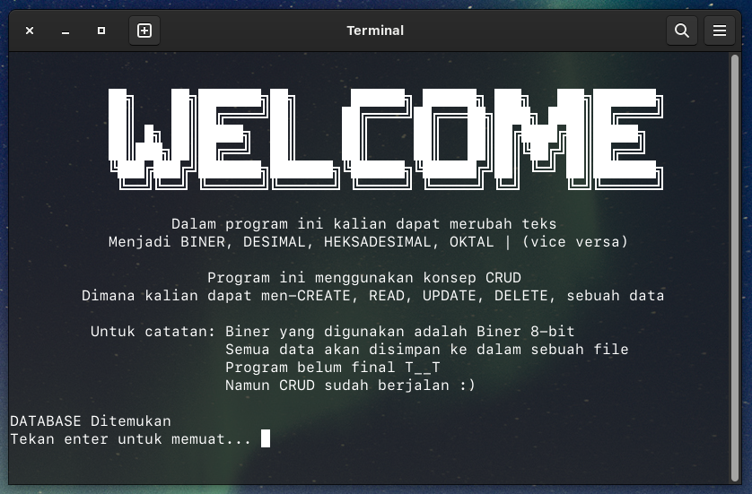
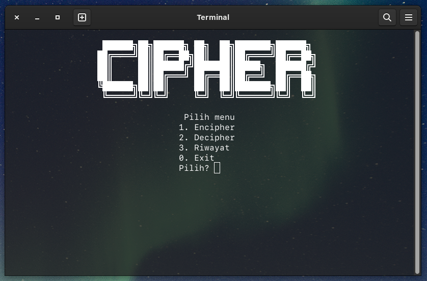
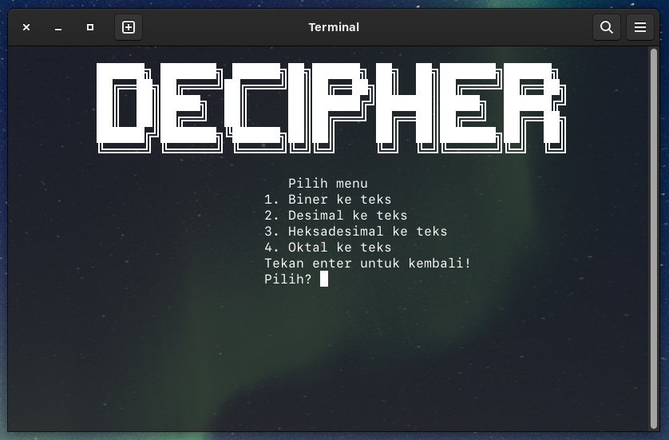
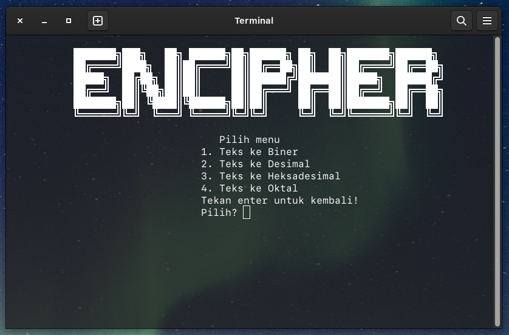
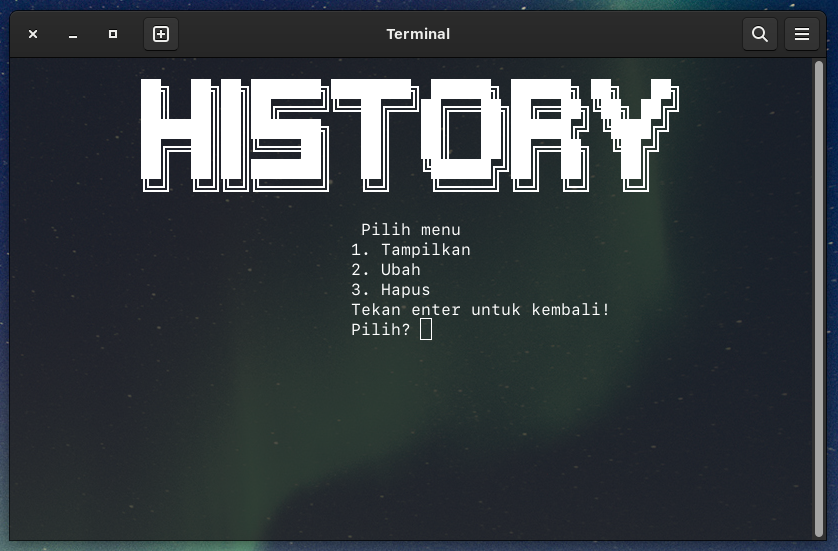
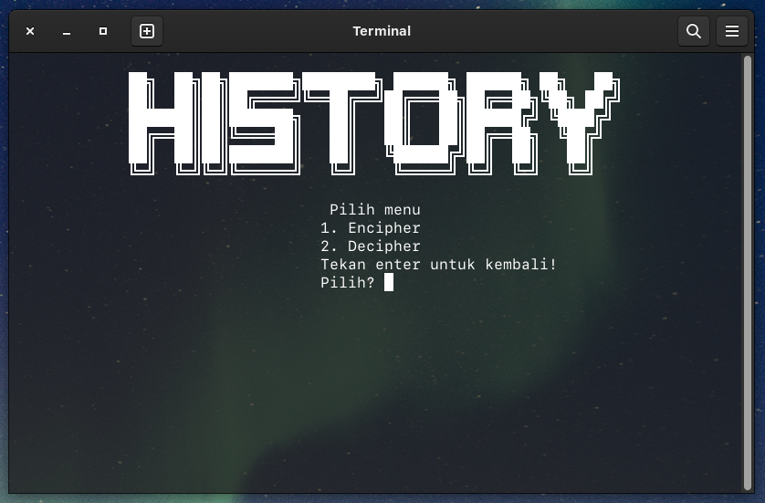
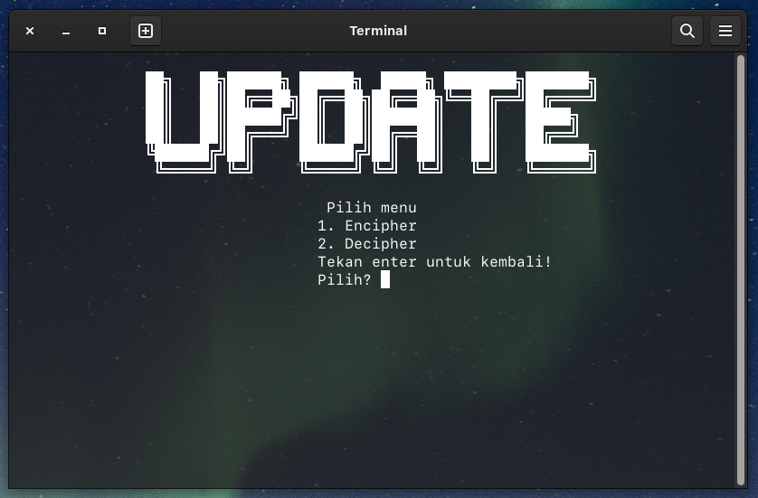
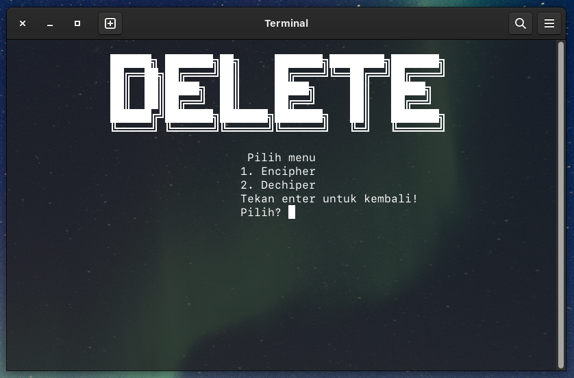

# ˈsīfər

Enchiper (~Mengubah sebuah pesan menjadi sebuah kode) 
Dechiper (~Mengubah kode menjadi sebuah pesan)

---

### Screenshot

---

- Awal program

- Menu Cipher

- Menu Decipher

- Menu Encipher

- Menu Riwayat

---
### List Fitur
---
|      Fitur      | TERSEDIA |   BELUM  |     BUG     |
|-----------------|:--------:|:--------:|-------------|
| TEKS ke Biner   |    ✅    |          | None so far |
| Biner ke Teks   |    ✅    |          | None so far |
| Teks ke Desimal |          |    ⭕️    |             |
| Desimal ke Teks |          |    ⭕️    |             |
| Teks ke Heksa   |          |    ⭕️    |             |
| Heksa ke Teks   |          |    ⭕️    |             |
| Teks ke OKtal   |          |    ⭕️    |             |
| Oktal ke Teks   |          |    ⭕️    |             |
|     CREATE      |    ✅    |          | None so far |
|      READ       |    ✅    |          | None so far |
|     UPDATE      |    ✅    |          | None so far |
|     DELETE      |    ✅    |          | None so far |
|    Database     |    ✅    |          | None so far |

---
#### Kendala
---
Baris kode yang masih terlalu panjang  
Penulisan kode masih belum efisien  
